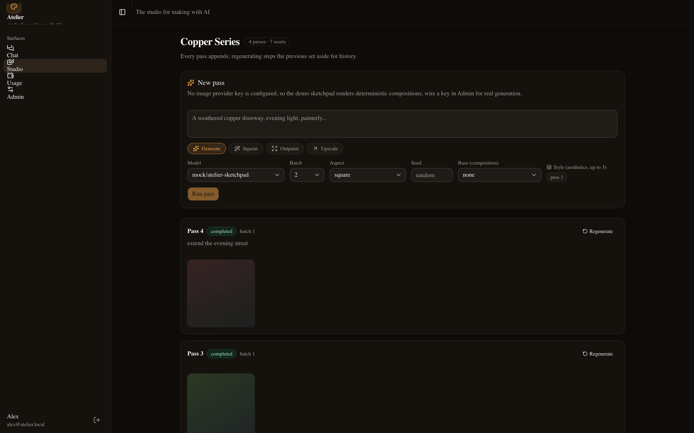
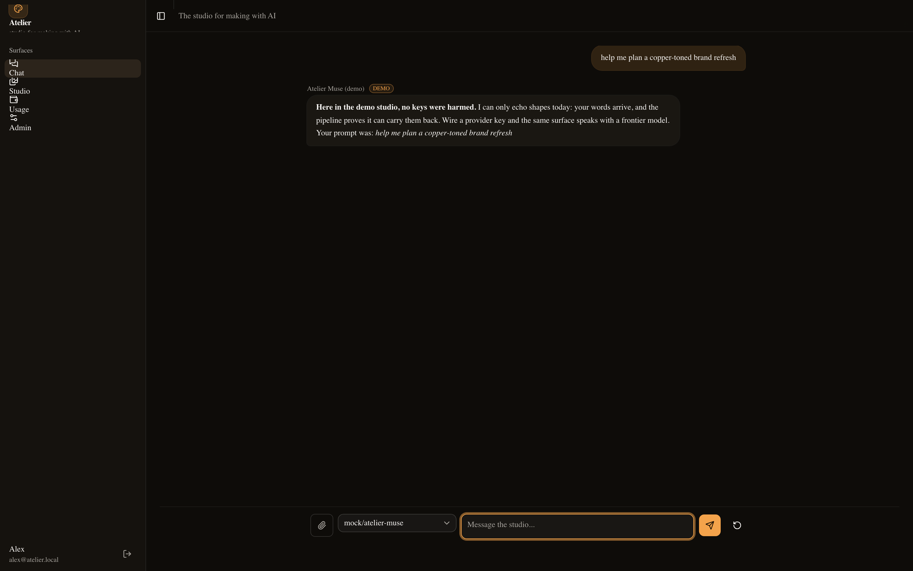
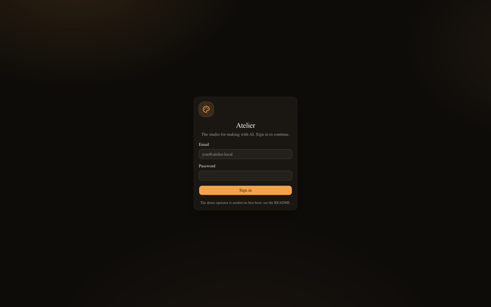
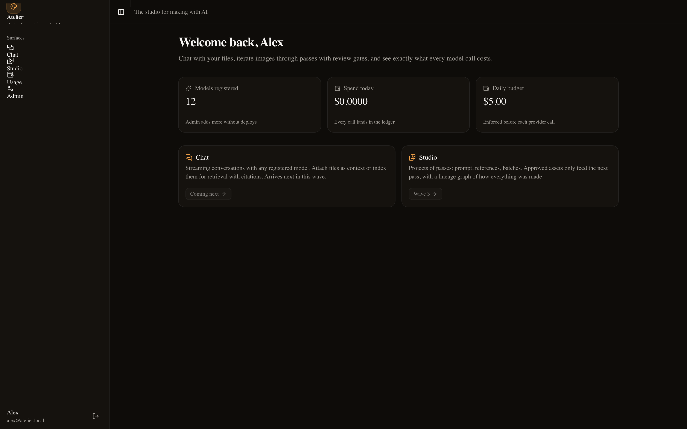
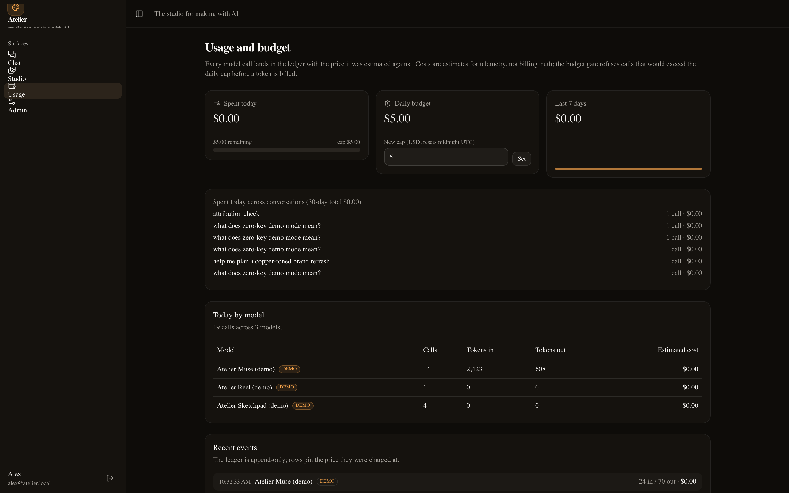
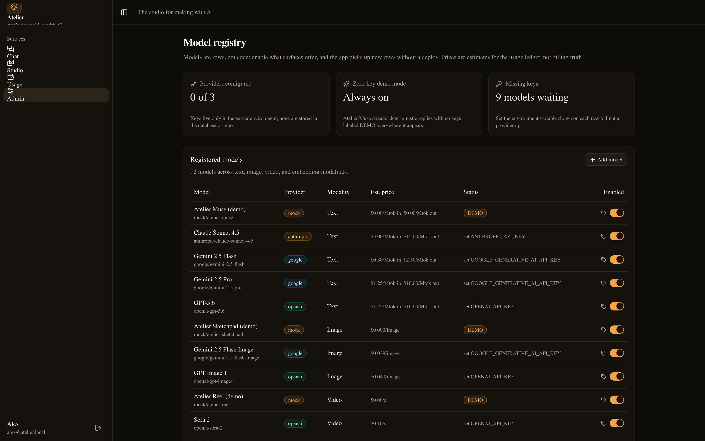

# Atelier

A creative studio for working with AI: streaming chat with file attachments and retrieval, an image studio where work advances through reviewable passes with lineage, video jobs, and a model registry with real cost accounting. It runs end to end with zero API keys.

The live demo never calls out to a provider. Three built-in models, Atelier Muse for chat, Atelier Sketchpad for images, and Atelier Reel for video, produce deterministic, clearly labeled demo output locally. Add an Anthropic, OpenAI, or Google key and the same surfaces switch to frontier models, with per-turn pricing read from the registry.



## What you can do in Atelier

**Chat with models and files.** Conversations stream token by token, persist across reloads, and share a stable URL. Any registered chat model can be selected per turn, mid-conversation. Attach files in two modes: **context** mode feeds the document into the prompt (PDFs are parsed, long documents keep head and tail), while **retrieval** mode chunks and embeds the file into pgvector and grounds the reply in hybrid semantic + keyword search with `filename#chunk` citations.



**Iterate images through passes.** A project holds passes: a generate pass turns a prompt into a batch of seeded images; inpaint, outpaint, and upscale passes build on earlier work (paint a mask, pick a direction and percent, choose a factor). Every variant is kept, superseded versions fold away, and nothing is lost. Only assets you approve can feed later passes or exports. The lineage graph draws how every image was made: solid edges for base references, dashed for style references. Finished assets export to PNG, JPEG, or WebP and land in an export log.

**Commission video.** Submit a prompt, duration, and optionally an approved first frame; a job renders and can be polled from the studio page, downloaded, and its cost lands in the same ledger. With a key configured, the port adapts to OpenAI (Sora) and Google (Veo) job APIs.

**Run on a budget.** A daily spend cap is enforced before every provider call: text is estimated per turn, images per image in the batch, video per second of duration. Over the cap, the call is refused with a 402 that names the numbers; free demo models are never blocked. Every completed call writes a usage event that pins the price in effect at that moment, so historical spend stays truthful even after a price change.

**Manage models like an operator, not a deployer.** The admin page registers new models (provider, modality, context window, capabilities) and appends effective-dated prices, so the price history is auditable rather than a mutable field. The registry knows which providers have keys configured and moves the free demo models to the top when none do.

## Screenshots

| | |
|---|---|
|  |  |
|  |  |

## Run it

```bash
docker run -d --name atelier-pg -p 5433:5432 -e POSTGRES_USER=atelier -e POSTGRES_PASSWORD=atelier-dev -e POSTGRES_DB=atelier pgvector/pgvector:pg17
bun install
cp .env.example .env.local   # fill in the generated auth secret
bun run db:migrate
bun run db:seed
bun dev
```

Sign in with `alex@atelier.local` / `atelier-demo`. The seed registers 12 models across chat, image, embedding, and video modalities; the three demo models work with no keys.

To use a real provider, set one of `ANTHROPIC_API_KEY`, `OPENAI_API_KEY`, or `GOOGLE_GENERATIVE_AI_API_KEY` in `.env.local` and enable that provider's models in the admin page.

### Tests

```bash
bun test                # unit: registry, budget math, mock generators, file pipeline
bun run e2e             # Playwright: login gate, chat round trip, studio + admin, usage
```

`bun run e2e` builds, migrates, seeds, boots the production server, and runs the suite against it, so the tests cover the app as shipped, not a dev-mode proxy.

## Stack

Next.js (App Router) on Bun, TypeScript throughout, Tailwind CSS v4 with the shadcn base-nova component kit, AI SDK for the provider boundary, PostgreSQL 17 with pgvector and Drizzle migrations, better-auth for sessions, Playwright for end-to-end tests. One `docker run` (the database) is the only infrastructure.

## Project layout

- `src/app` - pages and API routes
- `src/components` - UI, chat, and studio components
- `src/lib/models` - the model registry, provider resolution, demo generators
- `src/lib/studio` - pass execution, image tools, lineage queries
- `src/lib/video` - the video provider port and adapters
- `src/lib/files` - extraction, chunking, hybrid retrieval
- `src/lib/usage` - budget gate and cost ledger
- `src/db` - Drizzle schema and client
- `drizzle` - SQL migrations
- `e2e` - Playwright suite

## Glossary

- **Pass** - one step of image work in a project: a prompt plus settings (generate), or a tool applied to earlier work (inpaint, outpaint, upscale). Passes append; regenerating supersedes rather than overwrites.
- **Asset** - a produced image. Assets carry a review status; only approved assets can be referenced by later passes or exported.
- **Lineage** - the graph of which assets fed which pass, drawn as base (solid) and style (dashed) edges.
- **Registry** - the database table of models the app may use, with per-model effective-dated prices. Adding a model is an admin action, not a deploy.
- **Usage event** - one row per completed provider call: tokens or images or seconds, the pinned price, the computed cost, linked to the conversation or pass.
- **Budget gate** - the check that runs before every provider call, comparing today's ledger total plus the call's estimate against the daily cap.
- **Demo mode** - the state where no provider keys are configured and the built-in zero-cost models serve every surface, with output labeled DEMO.
- **Hybrid retrieval** - search that fuses vector similarity (pgvector cosine) with full-text keyword search using reciprocal rank fusion, then cites chunks back to the source file.
- **Effective-dated price** - a price row valid from a timestamp; the cost of a call is computed from the row in effect when it ran, and appended corrections never rewrite history.

## Honest scope

What is here is real and tested; what is not here is listed so absence reads as scope, not oversight.

- Demo generators are intentionally simple: Muse echoes structured replies, Sketchpad draws deterministic geometric compositions, Reel renders a title card. They exist to prove the pipelines, not to fake intelligence.
- Video adapters for Sora and Veo are typed, budget-gated request/response ports exercised end to end only by the local demo renderer; without keys those paths stay untested against live APIs.
- Outpaint and inpaint composite locally through a fill-and-mask seam rather than provider-native image editing.
- Everything is single-node: local disk storage, no queue, no horizontal scale.

Engineering detail, decisions, and traps live in [TECHNICAL.md](TECHNICAL.md).
